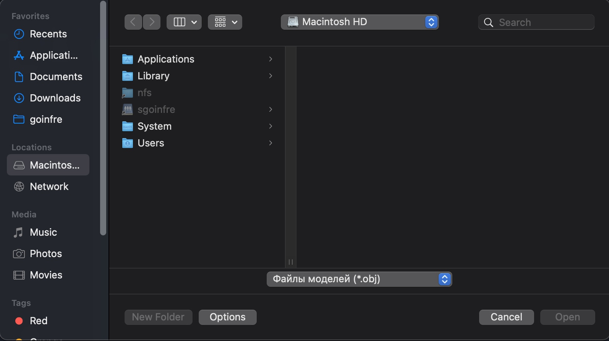
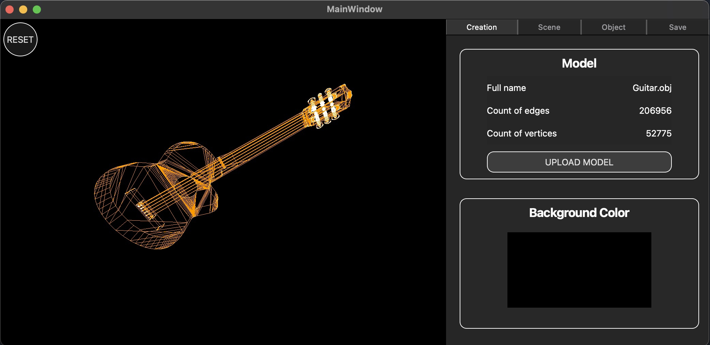
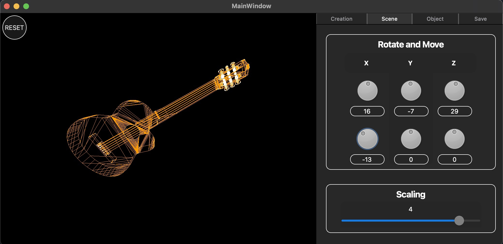
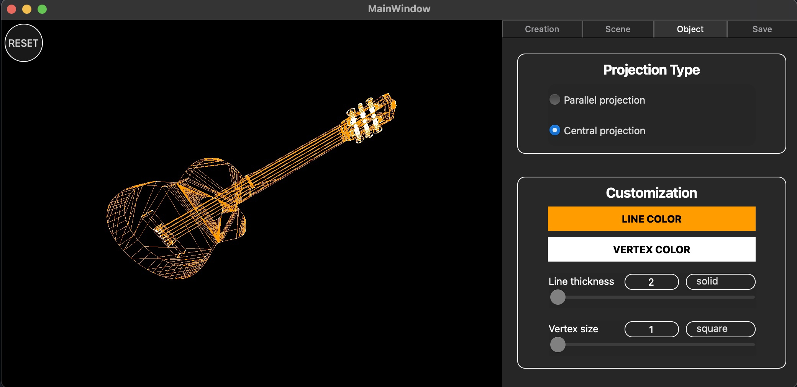
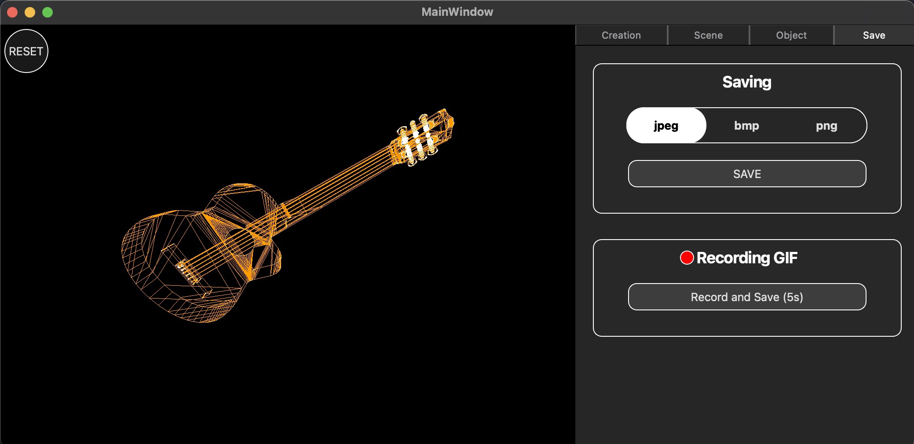

# 3DViewer

## Table of Contents
1. [Introduction](#introduction)
2. [Goals](#goals)
3. [Build](#build)
4. [Features](#features)
5. [Screenshots](#screenshots)

## Introduction
3DViewer is a program designed for visualizing 3D wireframe models. The program is developed using the C language, relying on C11 standard and the gcc compiler. It supports various operations on the models, including translation, rotation, and scaling.

## Goals
- Develop a comprehensive 3D wireframe model viewer
- Learn and apply best practices in C programming
- Improve Makefile usage and workflow
- Implement GUI using appropriate libraries (such as Qt)

## Build
The build process for 3DViewer relies on Makefile and involves the following targets: all, install, uninstall, clean, dvi, dist, tests, gcov. The code must be placed in the "src" folder.

## Features
- Load wireframe model from an obj file (vertices and surfaces list support only)
- Translate the model by a given distance in relation to the X, Y, and Z axes
- Rotate the model by a given angle relative to its X, Y, and Z axes
- Scale the model by a given value

- Allow customizing the type of projection (parallel and central)
- Allow setting up the type (solid, dashed), color and thickness of the edges, display method (none, circle, square), color, and size of the vertices
- Allow choosing the background color
- Save settings between program restarts

- Allow saving captured (rendered) images as BMP and JPEG files
- Allow recording small screencasts with a special button, saving the current custom affine transformation of the loaded object as GIF animation (640x480, 10fps, 5s)

## Screenshots

